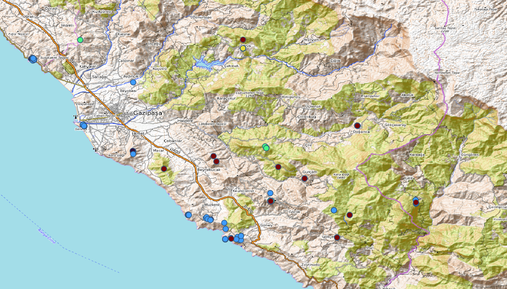

# Rough-Cilicia-Survey-Database
A spatial database built on open archaeological survey data from Rough Cilicia (southern Anatolia, Türkiye), implemented in PostgreSQL / PostGIS. It pairs a standards-aligned, Linked-Open-Data-ready ingest model with a denormalized analysis layer for querying and mapping in QGIS.

# Rough Cilicia Survey Database (`cilicia_db`)

A spatial database built on open archaeological survey data from **Rough Cilicia** (southern Anatolia, Türkiye), implemented in **PostgreSQL / PostGIS**. It pairs a **standards-aligned, Linked-Open-Data-ready ingest model** with a **denormalized analysis layer** for querying and mapping in QGIS.


---

## Overview

`cilicia_db` turns a published open dataset — the Rough Cilicia Archaeological Survey — into a queryable, mappable, standards-aware spatial database. It is deliberately built in **two layers**:

- a normalized **`cilicia`** schema that mirrors the source's own data model (projects, subjects, sites, controlled vocabularies, and an assertion/observation model), and
- a flat **`public`** schema optimized for analysis and GIS visualization.

This mirrors a core distinction in archaeological data management: keeping a faithful, extensible, **FAIR-oriented** representation of the source separate from a practical, denormalized layer built for day-to-day querying.

All geometry is stored in **EPSG:4326 (WGS 84)** for portability and alignment with the source coordinates.

> **Scope note:** This is a *survey* database. It records the spatial, typological, and descriptive attributes of features (tombs, monuments, sites) — not photographs, RTI, or photogrammetry, which were not part of the survey's published output. This reflects the nature of a **project database** rather than a **resource database**, and is by design.

---

## Data Source & License

The underlying archaeological data comes from:

> Rauh, Nicholas K. (2012). *Rough Cilicia Archaeological Survey Project.* Open Context. <br>
> https://opencontext.org/projects/295b5bf4-0f44-4698-80cd-7a39cb6f133d <br>
> DOI: https://doi.org/10.6078/M7X0656S <br>
> ARK: https://n2t.net/ark:/28722/k2bk1cx70 <br>
> Released under **CC BY 4.0**.

---

## Architecture

```
cilicia schema  ── normalized, LOD-ready ingest model
  projects ─┬─ subjects ─── observations ── predicates
            │      │              │
            └─ sites             types
                                media

public schema   ── flat analysis / GIS layer
  sites ──1:N── finds        (finds.site_id → sites.id)
```

### `cilicia` schema — normalized ingest model

A faithful, extensible representation of the source, designed around Open-Context-style items and assertions. URI columns (`oc_uri`, `class_uri`) keep every record linkable back to the published Linked Open Data.

| Table | Rows | Purpose |
|---|---|---|
| `projects` | 1 | Dataset-level metadata (creator, license, abstract, temporal bounds, bbox) — Dublin-Core-style descriptive layer |
| `subjects` | 287 | Individual survey items with class, location, and temporal attributes |
| `sites` | designed | Site-level containers with location + bounding box |
| `types` | designed | Controlled vocabulary terms |
| `predicates` | designed | Property definitions (typed attributes) |
| `observations` | designed | Subject–predicate–value assertions (EAV model) |
| `media` | designed | Linked media references |

**Views:** `v_sites_summary`, `v_subjects_by_class`, `v_subjects_with_coords`
**Functions:** `distance_km(geom, geom)`, `find_subjects_within_radius(lon, lat, radius_km)`

> The assertion tables (`observations`, `types`, `predicates`, `media`) are structurally in place as an extensible backbone; the current release populates the project- and subject-level records.

### `public` schema — analysis layer

A denormalized, query- and QGIS-friendly layer.

**`finds`** — 257 records
`id`, `subject_id`, `label`, `category`, `period`, `latitude`, `longitude`, `geom`, `site_id` → `sites.id`, `tomb_type`, `typology`, `inscribed`, `feature_desc`, `material`, `detail`, `comment`, `has_note`, `length`, `width`, `thick`, `elevation`, `utm_x`, `utm_y`

**`sites`** — 26 records
`id`, `subject_id`, `label`, `location_code`, `site_category`, `cultural_type`, `topography`, `geom`

Related by `finds.site_id → sites.id` (foreign key `fk_site`).

---

## Tech Stack

- **PostgreSQL 17** + **PostGIS** — spatial database engine
- **uuid-ossp** — UUID primary keys in the normalized layer
- **EPSG:4326** (WGS 84) — coordinate reference system
- **QGIS** — visualization, categorized symbology, buffer analysis
- **OpenStreetMap** — basemap

---

## Getting Started

This repository ships the database as a plain-SQL `pg_dump`.

```bash
# 1. Create an empty database (PostGIS must be available)
createdb cilicia_db

# 2. Restore schema + data
psql -d cilicia_db -f rough-cilicia-latest.sql
```

That single file recreates both schemas, all tables, indexes, views, functions, and data.

---

## Example Queries

**Finds per site**
```sql
SELECT s.label AS site, COUNT(f.id) AS n_finds
FROM public.sites s
LEFT JOIN public.finds f ON f.site_id = s.id
GROUP BY s.label
ORDER BY n_finds DESC;
```

**Distribution of tomb types**
```sql
SELECT tomb_type, COUNT(*) AS n
FROM public.finds
WHERE tomb_type IS NOT NULL
GROUP BY tomb_type
ORDER BY n DESC;
```

**Spatial search — subjects within 5 km of a point** (custom function)
```sql
-- longitude, latitude, radius_km
SELECT * FROM cilicia.find_subjects_within_radius(32.5, 36.1, 5.0);
```

**Summary by class** (view)
```sql
SELECT * FROM cilicia.v_subjects_by_class;
```

More examples live in [`queries/examples.sql`](queries/examples.sql).

---

## Map 

*Rough Cilicia survey finds over an OpenTopoMap basemap, with categorized symbology by tomb type.*
---

## Author

**`Melisa Çelik`** 

---

## Acknowledgments

Data © Nicholas K. Rauh and the Rough Cilicia Archaeological Survey Project, published on Open Context under CC BY 4.0. This repository exists thanks to their commitment to open archaeological data.
